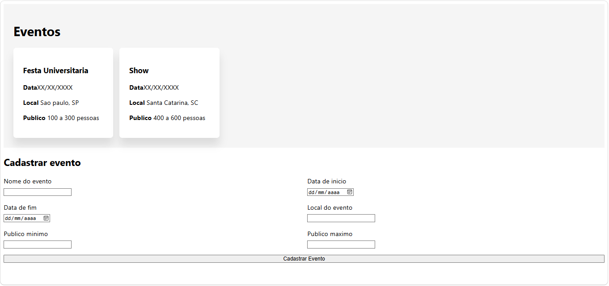

# Lista de Eventos e Formulário de Cadastro

Exercício de prática de HTML e CSS (Flexbox + Grid), feito como parte do estudo para o [Projeto Interdisciplinar TrocaTicket](https://github.com/Brian-Walter) — plataforma de planejamento e precificação de eventos.

## Demo

- **Site publicado:** []
- **Repositório:** [(https://github.com/Brian-Walter/frontend)]

## Preview



> Dica: tire um print da página (a mesma tela que você me mandou) e salve como `preview.png` na raiz do projeto pra essa imagem aparecer no README.

## Tecnologias

- HTML5 semântico
- CSS3 (Flexbox e CSS Grid)
- Layout responsivo (media query)

## Funcionalidades

- Lista de eventos em cards, organizados com Flexbox (`display: flex; flex-wrap: wrap`)
- Formulário de cadastro de evento em grid de 2 colunas, com campos: nome, data de início, data de fim, local, público mínimo e máximo
- Layout responsivo: o formulário passa para 1 coluna em telas menores que 600px

## Como rodar localmente

```bash
git clone https://github.com/Brian-Walter/frontend.git
cd frontend
```

Depois é só abrir o `index.html` no navegador, ou usar a extensão **Live Server** do VS Code pra ter recarregamento automático.

## O que pratiquei

- Estrutura HTML válida (`head`/`body` como elementos irmãos)
- Uso correto de `label` + `for`/`id` para acessibilidade
- Diferença entre aplicar Flexbox no elemento pai correto (`ul` vs. `section`)
- Nomenclatura consistente de classes (kebab-case) entre HTML e CSS

## Próximos passos

- Conectar o formulário a uma API real (Node.js + Express + MySQL), como parte do desenvolvimento do TrocaTicket
- Adicionar validação e feedback visual ao enviar o formulário